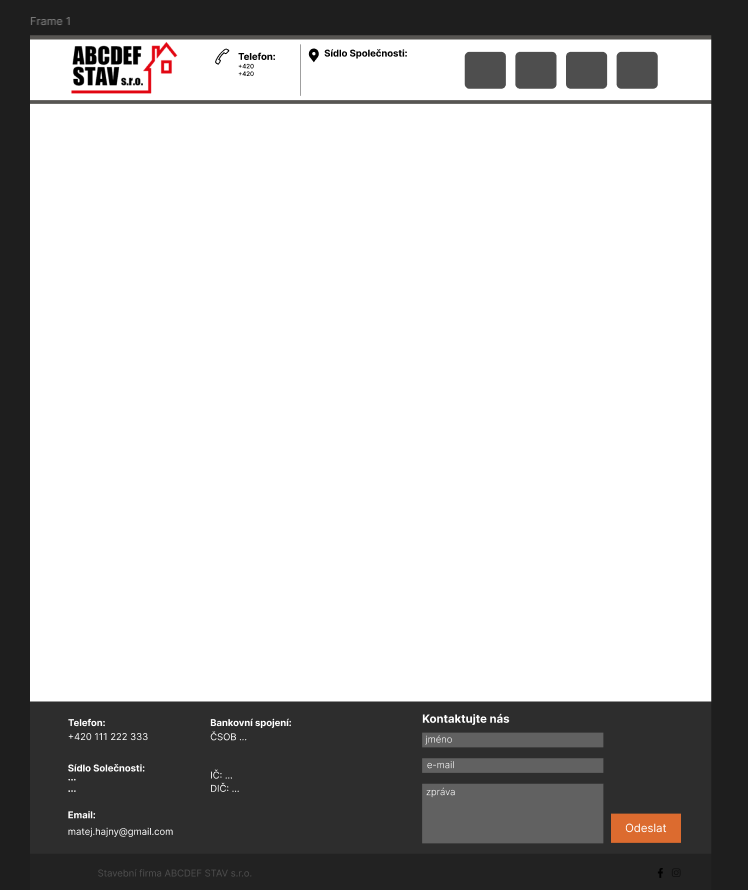
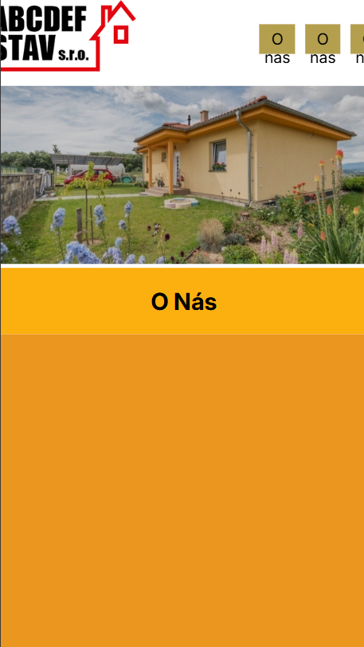
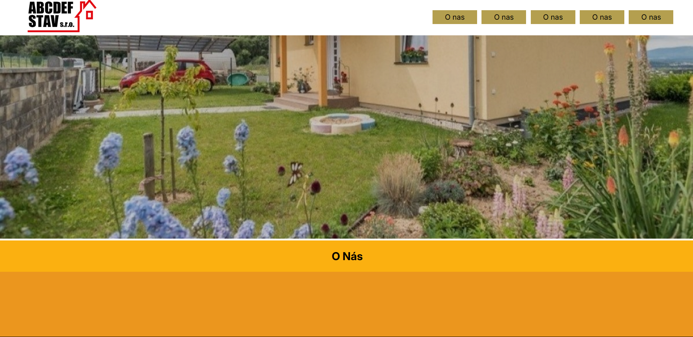

# Téma: Firemní Web pro firmu ABCDEF Stav s.r.o
  Dne 5.2.2025 jsme dostaly zadní, vytvořit vzorový web pro stavební firmu
  ## Počátky
  
  První návrhy webu jsem vytvářel v grafickém programu __Figma__. Začal jsem návrhem samotnéstránky, jeím pozadím, rozložením jednotlivích objektů, pozicování atd.

  ### První návrh stránky
  
  

  ## Tvorba Webu
  Po vytvoření návrhu jsem začal dělat samotný web. 

  ### První řádky kodu
  __HTML__
  ```html
     <header>
        <div class="header-menu">
            
            <div class="content">
                <a href="#">O nas</a>
                <a href="#">O nas</a>
                <a href="#">O nas</a>
                <a href="#">O nas</a>
                <a href="#">O nas</a>
            </div>
        </div>
    </header>
```
__CSS__
```css
  *{
    box-sizing: border-box;
    font-family: inter
}

body{
    margin: 0;
    padding: 0;
    height: 100%;
    width: 100%;
}

h3{
    color: #fff;
}

header{
    width: 100vw;
    position: fixed;
    background-color:#fff ;
}

.content{
    position: relative;
    right: -10%;
    width: 35vw;
    display: flex;
    justify-content: space-evenly;
}
```

## Náhled
Zde jsou náchledy na danou stránku. Ne vše zdaleka dodělané, ale bud na ní pracovat stále a časem bude hotová a bude moct sloužit jako skvělí materiál.

### Mobilní pohled


### Desktopový pohled

